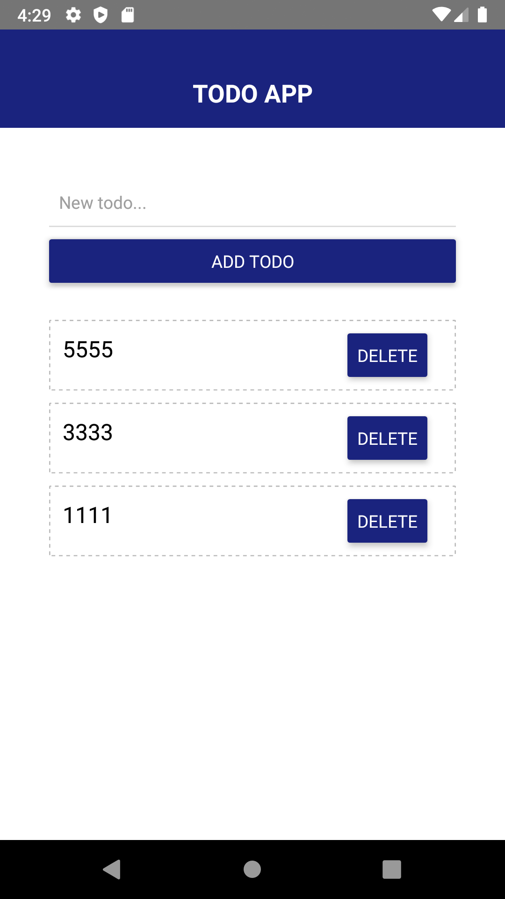

# TODO APP - React Native
Simple React Native Todo App

## Description
Example Todo App built with React Native.

## Setup

Clone this repository:

`git clone https://github.com/rahulshukla-rs/todo-react-native.git`

Navigate to the project Folder:

`cd todo-react-native`

Install dependencies:

`npm install`

Be sure to have the corresponding SDK for each platform. Install app on device:

Terminal 1:
`npx react-native start`

Terminal 2:
`npx react-native run-ios`
OR
`npx react-native run-android`

## ScreenShot

## License

MIT
